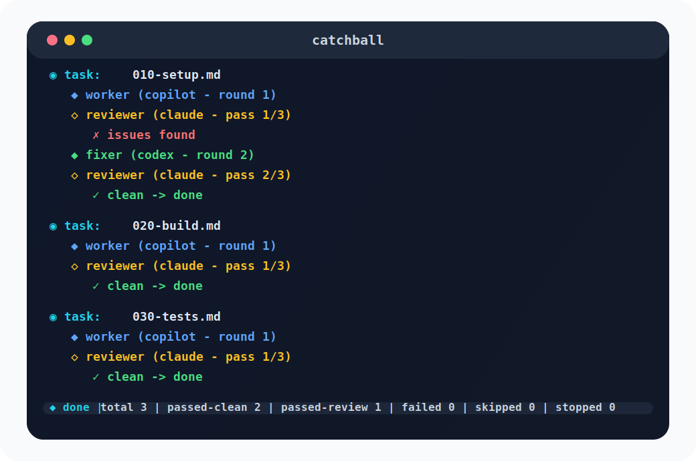

# catchball
Don't bounce between Codex, Claude and Copilot.

Put tasks under ./tasks, run catchball, and it handles the implement → review → fix loop until everything is clean.

For example, say you created these tasks in the tasks folder:

- `010-setup.md`, 
- `020-build.md`, 
- `030-tests.md` .

Then ask catchball to coordinate the work:

```bash
uv run catchball --worker copilot --reviewer claude --fixer codex
```


Each task runs through this loop until it passes or fails.


## Prerequisites
- Python 3.11+ — https://www.python.org/downloads/
- `uv` — https://docs.astral.sh/uv/getting-started/installation/
- At least one agent CLI on your `PATH`:
    - [Claude Code](https://code.claude.com/docs/en/overview)
    - [OpenAI Codex](https://developers.openai.com/codex/cli)
    - [GitHub Copilot](https://github.com/features/copilot/cli)
    - [OpenCode](https://opencode.ai/docs/cli/)

## Quick start
Run from a local checkout:

```bash
git clone https://github.com/hosamsh/catchball.git
cd catchball
uv run catchball --worker claude --reviewer codex
```

To install `catchball` directly from GitHub as a standalone command:

```bash
uv tool install git+https://github.com/hosamsh/catchball.git
catchball --worker claude --reviewer codex
```

If you already cloned the repo and want the same standalone command from this checkout:

```bash
uv tool install .
catchball --worker claude --reviewer codex
```

To run against a project in a different folder:

```bash
catchball --project-root ../my-app --worker claude --reviewer codex
```

Agents run inside `project-root` and pick up any existing harness automatically (`AGENTS.md`, `CLAUDE.md`, etc.)

## FAQ

### What tools are supported?
Claude Code, OpenAI Codex, GitHub Copilot, and OpenCode. You can use one for everything or mix and match as you wish.

### What goes in a task file?
Plain markdown. Describe what you want built, fixed, or changed. catchball attaches the task file path to the worker as the prompt. One clear goal per file works best.

### How does the review loop work?
Worker runs first, then the reviewer. If the reviewer finds nothing to flag, the task passes. If it writes issues to a `.review` file, the fixer (or worker) gets a fix round. The fixer can either fix the issues or write a `.response` file for any issues it is intentionally pushing back on. Before the next review pass, catchball archives the active `.review` and `.response` together for that round, then the reviewer reads both before deciding what still stands. This repeats up to `--review-passes` times (default 3).

### How do I pick a model?
Use `--worker-model`, `--reviewer-model`, or `--fixer-model`:

```bash
catchball --worker claude --worker-model opus --reviewer codex --reviewer-model gpt-5.4
```

OpenCode uses its native `provider/model` naming, for example:

```bash
catchball --worker opencode --worker-model anthropic/claude-sonnet-4-5 --reviewer codex
```

### Can I set the effort level?
If the tool supports it:

```bash
catchball --worker claude --reviewer codex --worker-effort high --reviewer-effort medium
```

### Can I provide custom instruction files?
Use `--worker-instructions`, or `--reviewer-instructions`:

```bash
catchball --worker claude --reviewer codex --worker-instructions ./WORKER.md --reviewer-instructions ./REVIEWER.md
```

If add `WORKER.md` or `REVIEWER.md` exist at repo root, catchball picks them up automatically.

### Can I add a dedicated fixer?
`--fixer` is optional. When set, fix rounds use that agent instead of the worker.

```bash
catchball --worker copilot --fixer codex --reviewer claude
```

OpenCode works there too:

```bash
catchball --worker opencode --fixer codex --reviewer claude
```

If `FIXER.md` exists at repo root, catchball picks it up. Otherwise it uses `WORKER.md` as guidance.

Fix rounds keep reviewer and fixer ownership separate: reviewers write `.review` files, and fixers write `.response` files only when they are intentionally not fixing a flagged issue in that round.

### Can I run catchball from outside the target repo?
Yes, but set the `--project-root`:

```bash
catchball --project-root ../my-app --worker claude --reviewer codex
```

Agent CLIs run in that folder and relative paths like `./tasks` resolve from there.

### Can I use a different task folder?
```bash
catchball --worker claude --reviewer codex --tasks ./packages/api/tasks
```

### Can I start from a specific task?
Use `--from`:

```bash
catchball --worker claude --reviewer codex --from 020-build.md
```

### Can I change the number of review rounds?
Use `--review-passes`:

```bash
catchball --worker claude --reviewer codex --review-passes 5
```

`--retries` is supported as a compatibility alias for extra fix/review loops, but it cannot be combined with `--review-passes`.

### What happens when a task fails to clean after exhausing the review passes?
catchball marks it with a `.failed` sidecar and stops the whole opertion. Use `--continue-despite-failures` to keep moving on to next tasks instead.

### Can I rerun a task list?
Tasks with a `.done` marker under `catchball-runs/state/` are skipped on reruns. Failed tasks get `.failed` instead and they are retried again next time.

Each tasks directory gets its own namespaced folder under that shared state tree, so rerun state stays persistent without mixing different task lists together.

The namespace is intentionally flat and readable, based on the tail of the tasks path. For example, `.samples/sample-tasks/js-click-game` becomes `sample-tasks--js-click-game` under `catchball-runs/state/`.

For a completely fresh start, use `--reset-state` or delete the state folder:

```bash
catchball --worker claude --reviewer codex --reset-state
```

### Can I pass extra arguments to a tool?
Use `--worker-arg`, `--fixer-arg`, or `--reviewer-arg`:

```bash
catchball --worker claude --reviewer codex --worker-arg "--dangerously-skip-permissions"
```

Each passthrough flag consumes exactly one following token, even if that token begins with `-` or `--`. The `--worker-arg=value` form also works. Repeat the flag to pass multiple arguments.

### Can I add a delay between phases?
Yes. `--phase-delay` now defaults to `3`, and the same delay is also applied between completed tasks. Set it to `0` if you want to disable the pause entirely:

```bash
catchball --worker claude --reviewer codex --phase-delay 0
```

Each completed task also emits a timing summary line with total time plus worker, fixer, reviewer, and delay totals.

### Can I run tasks in parallel?
catchball is strictly sequential inside one task list. If some tasks are independent, split them into separate folders and run in separate terminals.

### What does `--allow-dirty-worktree` do?
catchball wants a clean git worktree before starting. This flag skips that check.

### What are these lock files?
They live under the shared `catchball-runs/state/` tree and prevent two runs from working the same task. Stale locks are cleared automatically.

### Where do the logs go?
Under `<active-root>/catchball-runs/<timestamp>/` — each run gets a log file, worker output, reviewer output, reviews, and fixer responses. Use `--state-dir` to override.

Run directories use an unambiguous UTC timestamp format.

### Is this another Ralph Wiggum?
Same spirit, more structure. catchball is a role-based multi-agent coding loop with fixed implement, review, and fix stages.